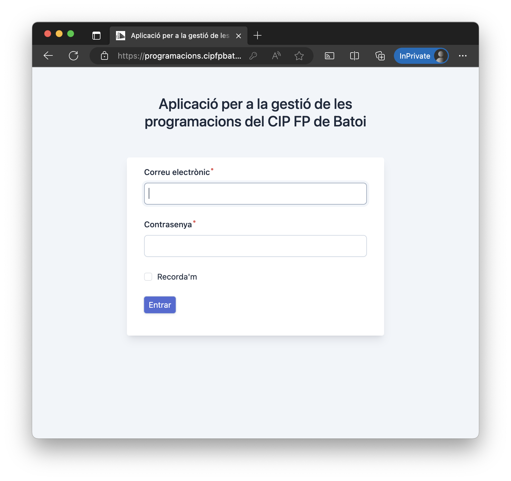
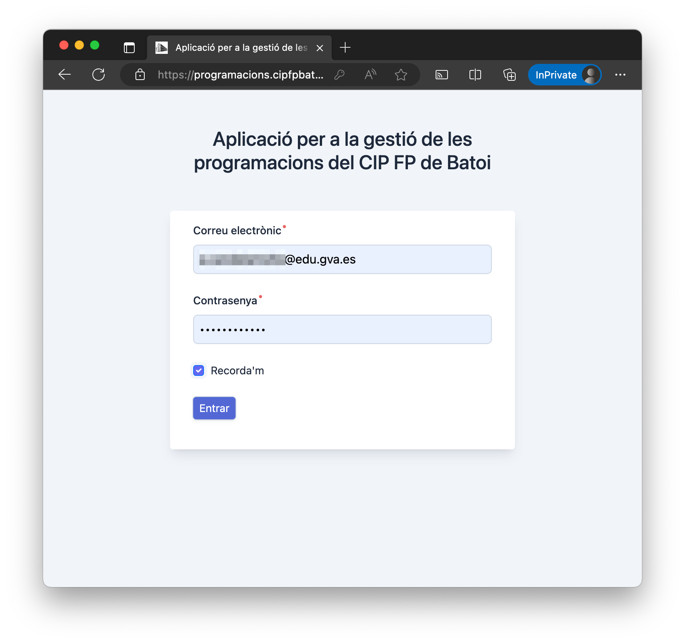
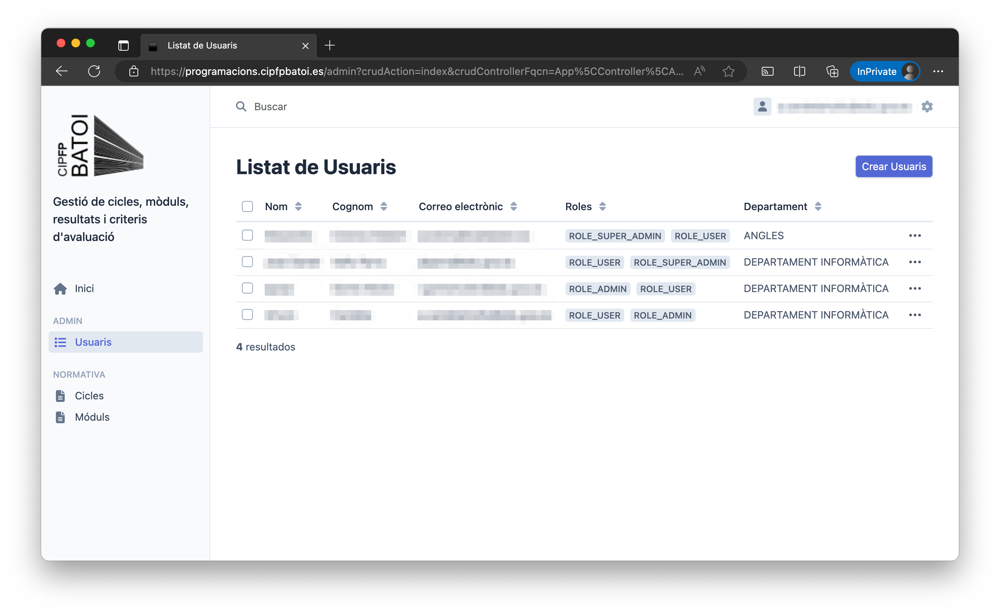
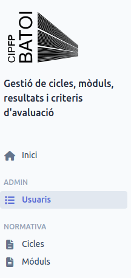
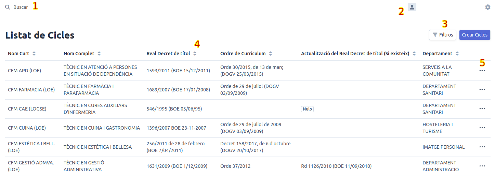

# Manual d'Usuari

Manual d'usuari per a la **Aplicació per a la Gestió de les Programacions del CIP FP de Batoi**

* [1. Accés a la Plataforma](#1-accés-a-la-plataforma)
* [2. Dintre de l'aplicació](#2-dintre-de-laplicació)
  * [2.1. Panell Esquerre](#21-panell-esquerre)
  * [2.2. Panell Dret](#22-panell-dret)

## 1. Accés a la Plataforma

Per accedir a la plataforma hem d'escriure al nostre navegador favorit la següent url: <https://programacions.cipfpbatoi.es/>. Una vegada hem accedit, s'ens mostrarà el panell d'autenticació:

Hem d'escriure les dades d'accés tal i com ens hagen indicat, en el meu cas, em registraré com el meu usuari amb la meua contrasenya i farem clic en *Entrar*.

## 2. Dintre de l'aplicació

Depenent del tamany inicial i del vostre usuari, veureu diferents coses. Per a treballar sobre el mateix esquema, deveu de maximitzar al màxim el navegador de forma que es veja la pantalla amb aquesta disposició:

Principalment es tracta d'un CRUD (Create - Read - Update - Delete). Al panell **esquerre**, que és proporcionalment més xicotet que l'àrea principal, es mostren tots els ítems que podem modificar. A l'**àrea principal**, veurem el contingut relacionat amb l'ítem seleccionat, sobre el qual podrem treballar.

### 2.1. Panell Esquerre

Tal com podem observar en aquest panell, podem navegar per les diferente àares en les que podem travallar. En el cas de l'usuari amb que està fent-se el manual, es poden revisar moltes àrees. Quan es clica el botó **Inici** es torna a l'àrea inicial d'edició. Les àrees més importants per a actualitzar la normativa i els continguts dels mòduls, son les següents:

1. **Cicles**: Aquesta secció ens permet treballar amb els cicles incloent informació important com família professional, Real Decret que el regula, etc.
2. **Mòduls**: Una vegada definitis els cicles, podem crear els mòduls i establir els resultats d'aprenentatge i els continguts per a cadascun d'ells.

### 2.2. Panell Dret

Les seccions **Cicles** i **Mòduls** tenen pràcticament els mateixos elements de navegació, a continuació s'adjunta una captura de pantalla que ens permetrà explicar les operacions comuns que podem fer en cadascun dels panells:

1. **Cercador**: Ens permet realitzar recerques a la secció a la que ens trobem per a facilitar-nos trobar el item amb que vulguem treballar.
2. **Usuari**: Ens permet tancar la sessió si fem clic a l'usuari. L'enganatge en canvi, ens permet alternar entre el tema fosc i el tema clar.
3. **Filtres i Crear**: El primer ens permet filtrar per qualsevol dels camps que es mostren (Aquesta característica està en desenvolupament). D'aquesta manera sols veurem els registres que coincideixen amb el filtre que hem definit. En funció dels nostres privilegis veurem un botó per a crear nous elements, per exemple cicles o mòduls. 
4. **Ordenació**: Aquestes fletxes ens permiteixen ordenar els registres mostrats pel camp elegit, de manera alfabètica de forma ascendent o descendent.
5. **Més Opcions** Aquests tres punts ens permiteixen treballar en el registre en concret i realitzar operacions sobre ell.
