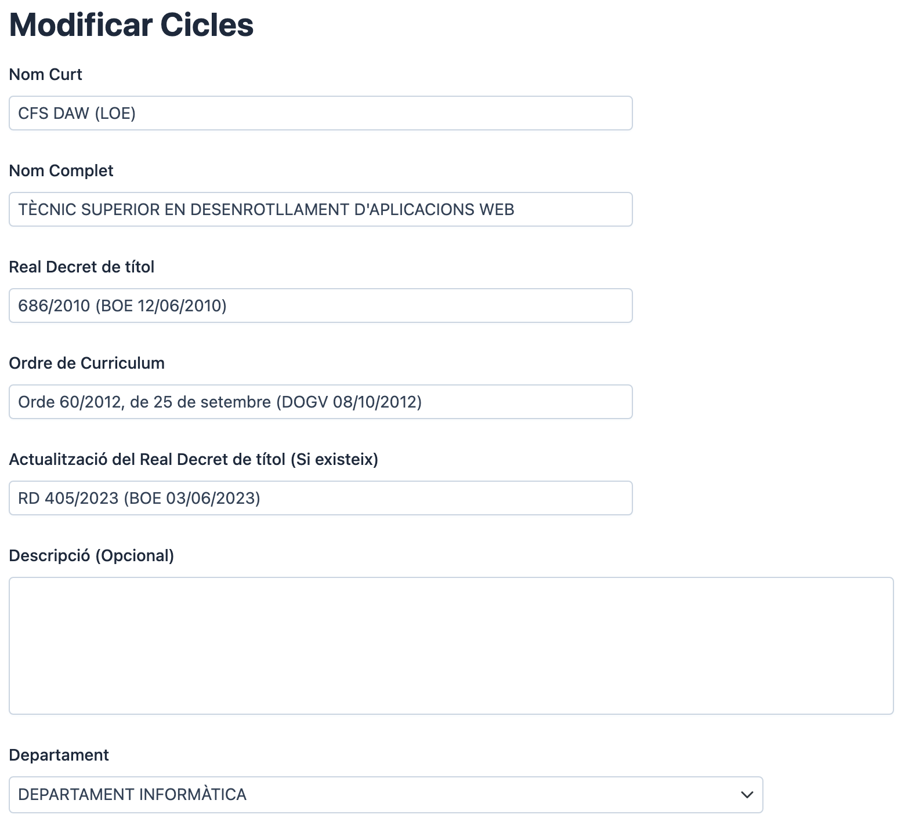
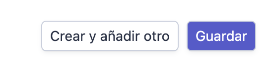
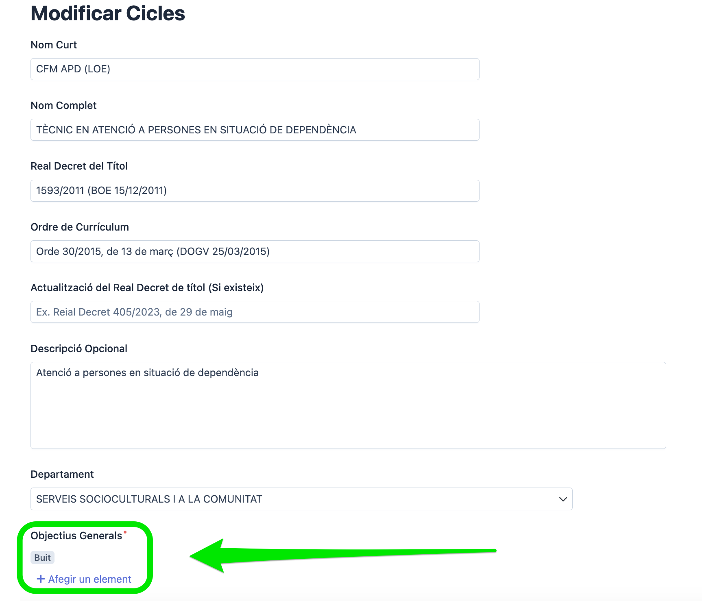
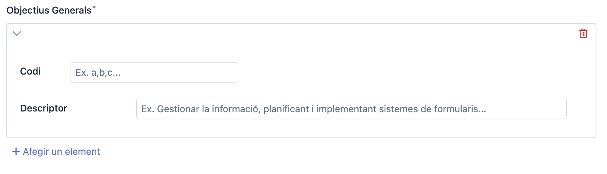
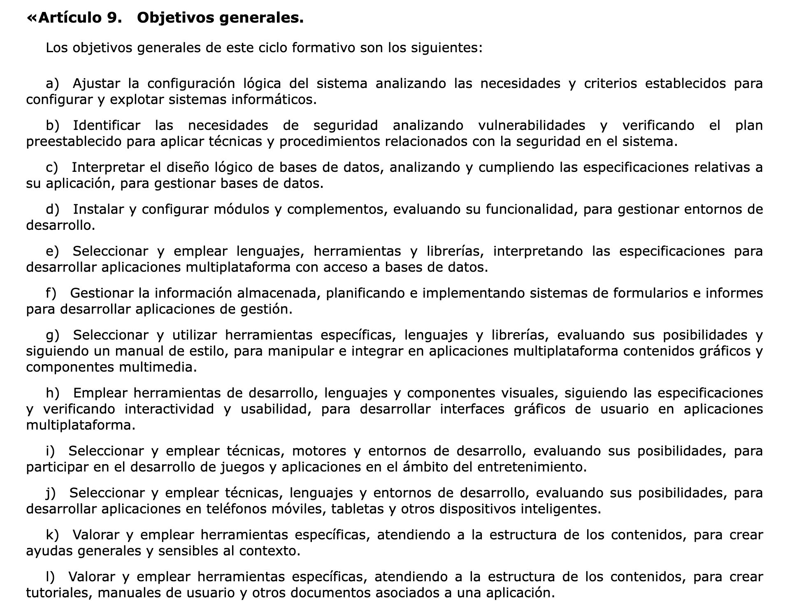
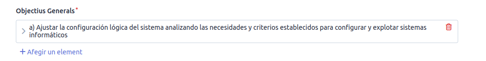

# Manual d'Usuari

Aquesta es la documentació que inclou el manual d'usuari per a la **Aplicació per a la Gestió de les Programacions del CIP FP de Batoi**

* [1. Accés a la Plataforma](./#1-accés-a-la-plataforma)
* [2. Dintre de l'aplicació](./#2-dintre-de-laplicació)
  * [2.1. Panell Esquerre](./#21-panell-esquerre)
  * [2.2. Panell Dret](./#22-panell-dret)
* [3. Cicles](./#3-cicles)
  * [3.1. Crear Cicles](./#31-crear-cicles)

## 1. Accés a la Plataforma

Per accedir a la plataforma hem d'escriure al nostre navegador favorit la següent url: [https://programacions.cipfpbatoi.es/](https://programacions.cipfpbatoi.es/). Una vegada hem accedit, s'ens mostrarà el panell d'autenticació:

Hem d'escriure les dades d'accés tal i com ens hagen indicat, en el meu cas, em registraré com el meu usuari amb la meua contrasenya i farem clic en _Entrar_.

## 2. Dintre de l'aplicació

Depenent del tamany inicial i del vostre usuari, veureu diferents coses. Per a treballar sobre el mateix esquema, deveu de maximitzar al màxim el navegador de forma que es veja la pantalla amb aquesta disposició:

Principalment es tracta d'un CRUD (Create - Read - Update - Delete). Al panell **esquerre**, que és proporcionalment més xicotet que l'àrea principal, es mostren tots els ítems que podem modificar. A l'**àrea principal**, veurem el contingut relacionat amb l'ítem seleccionat, sobre el qual podrem treballar.

### 2.1. Panell Esquerre

Tal com podem observar en aquest panell, podem navegar per les diferents àrees en les que podem travallar. En el cas de l'usuari amb que està fent-se el manual, es poden revisar moltes àrees. Quan es clica el botó **Inici** es torna a l'àrea inicial d'edició. Les àrees més importants per a actualitzar la normativa i els continguts dels mòduls, son les següents:

1. **Cicles**: Aquesta secció ens permet treballar amb els cicles incloent informació important com família professional, Real Decret que el regula, etc.
2. **Mòduls**: Una vegada definitis els cicles, podem crear els mòduls i establir els resultats d'aprenentatge i els continguts per a cadascun d'ells.

>

### 2.2. Panell Dret

Les seccions **Cicles** i **Mòduls** tenen pràcticament els mateixos elements de navegació, a continuació s'adjunta una captura de pantalla que ens permetrà explicar les operacions comuns que podem fer en cadascun dels panells:

1. **Cercador**: Ens permet realitzar recerques a la secció a la que ens trobem per a facilitar-nos trobar el item amb que vulguem treballar.
2. **Usuari**: Ens permet tancar la sessió si fem clic a l'usuari. L'enganatge en canvi, ens permet alternar entre el tema fosc i el tema clar.
3. **Filtres i Crear**: El primer ens permet filtrar per qualsevol dels camps que es mostren (Aquesta característica està en desenvolupament). D'aquesta manera s>ols veurem els registres que coincideixen amb el filtre que hem definit. En funció dels nostres privilegis veurem un botó per a crear nous elements, per exemple cicles o mòduls.
4. **Ordenació**: Aquestes fletxes ens permiteixen ordenar els registres mostrats pel camp elegit, de manera alfabètica de forma ascendent o descendent.
5. **Més Opcions** Aquests tres punts ens permiteixen treballar en el registre en concret i realitzar operacions sobre ell.

## 3. Cicles

Quan seleccionem l'opció **Cicles** se'ns mostra la següent informació:

Aquest panell ens permet crear nous cicles i actualitzar tota la informació necessària respecte a ells. Ara, en la última versió, quan accedim sols sens mostren els cicles del **nostre departament**.

Quina informació del cicle podem veure?:

1. **Nom curt** Nom curt del cicle, inclou si es un cicle formatiu de grau superior, Inicials del cicle i legislació per a diferenciar si es tracta d'un cicle LOE o LOGSE, per exemple: En el cas del: _Cicle Formatiu de Desenrotllament d'aplicacions Multiplataforma_ el nom curt seria: **CFS DAM (LOE)**
2. **Nom Complet** Nom tal com ve en el Reial decret que el defineix.
3. **Real Decret de títol** Real decret en el que es defineix el títol.
4. **Ordre de Currículum** Si hi ha Ordre de la Generalitat Valenciana que concrete el currículum de la titulació definida pel real decret.
5. **Actualització del Real Decret de títol (Si Existeix)** Si hi ha cap actualització del títol, estaria a aquest apartat.
6. **Departament** Departament al que pertany el títol.

Quines opcions tenim disponibles per a treballar amb els cicles?(Aquestes opcions les podem veure dalt a la dreta, just baix del nostre identificador)

* Opció **Filtros**: Actualment ens permeteix filtrar pels camps _Nom Curt_ i _Nom Complet_ del cicle per a que ens siga més fàcil buscar l'opció en la que volem treballar.
* Opció **Crear Cicles**: Quan prenem aquest botó ens mostra el panell per a crear cicles que es descriurà posteriorment.
* Opció **...**: Al polsar el aquest botó sens mostren dos noves opcions:
  * **Ver**: En permet visualitzar tota la informació del cicle **incloent els mòduls professionals donats d'alta** a l'aplicació i hiperenllaçats, de forma que si polsem dins d'aquest ens durà al panell de visualització del mòdul professional. En aquest panell, dalt a la dreta, tenim dues noves opcions que ens permeten **Volver al listado** en el que es mostren tots els mòduls o **Modificar** la informació relativa a la identificació del cicle formatiu.
  * Opció **Modificar**: Ens permet modificar la informació de identificació del cicle. Dal a la dreta, tenim opcions per a **Guardar i seguir editando** amb el desariem els canvis i seguiriem editant i per a **Guardar Cambios** amb el que desariem els canvis i tancariem el panell d'edició tornant al llistat de cicles.

### 3.1. Crear Cicles

Per a crear cicles hem de premer el botó **Crear Cicles** i se'ns mostrarà un panell on hem d'emplenar els següents camps:

1. **Nom Curt**: Nom curt del cicle en majúscules, cal utilitzar la següent nomenclatura:
   1. **CF** (Abreviatura de Cicle Formatiu) o **CE** (Curs d'especialització) seguit de **M** o **S** en cas de que en funció de si es tracta d'un Cicle Formatiu de Grau Mig o d'un Superior.
   2. **Nom abreviat del cicle formatiu**. Depenent de l'especialitat, s'utilitza una nomenclatura o un altra, per exemple, el nom abreviat del cicle formatiu *Desenrotllament d'Aplicacions Multiplataforma* sera **DAM**
   3. Legislació que el: Entre parèntesi si es tracta d'un cicle formatiu establit en legislació LOE o LOGSE.
   4. Exemple d'utilització: En el cas del *Tècnic en Cures auxiliar d'Infermeria* seria **CFM CAE (LOGSE)**. Per al cas de *Tècnic en Farmàcia i Parafarmàcia* seria: **CFM FARMACIA (LOE)** i per al cas del *Curs d'Especialització en Ciberseguretat en Entorns de les Tecnologies de la Informació* seria **CE CIBERSEGURETAT**
2. **Nom Complet** Nom complet del títol en majúscules, en el cas del cicle formatiu de grau superior de Desenrotllament d'Aplicacions Multiplataforma el nom seria: **TÈCNIC SUPERIOR EN DESENROTLLAMENT D'APLICACIONS MULTIPLATAFORMA**
3. **Real Decret del títol**: Es recomana utilitzar l'Identificador del Real Decret del titol que estableix el títol. El format a Utilitzar serà: `codi/any (BOE dd/mm/yyyy)` si no es possible sempre es pot afegir o modificar la informació que el departament identifique correctament la titolació. **Per exemple**: per al cicle de *CFM GESTIÓ ADMVA. (LOE)* seria **1631/2009 (BOE 1/12/2009)**
4. **Ordre del Currículum**: L'ordre o el document autonòmic si hi ha que concrete el títol per a la nostra comunitat. El format a utilitzar serà: `Ordre/Decret codi/any, de <dia> de <mes> (DOGV dd/mm/yyyy)`. En Qualsevol cas i depenent de la titolació de la que es tracte, sempre es podrà decidir si utilitzar una nomenclatura diferent si er al cicle en concret te sentit fer-ho d'una altra manera. **Per Example**: per al cilce *CFM ESTÈTICA I BELL. (LOE)* seria **Decret 158/2017, de 6 d'octubre (DOGV 20/10/2017)**
5. **Actualització del Real Decret de títol (Sí Existeix)**: En cas que a nivell estatal s'haja realitzat alguna actualització del títol, es necessari escriure introduir la referència del RealDecret on s'haja realitzat en aquest camp. Es sugereix aquesta manera d'intentificar-lo: `RD codi/any (BOE dd/mm/yyyy)`. Per exemple, en el cas de el cicle formatiu *CFM GESTIÓ ADMVA. (LOE)* seria: `RD 1126/2010 (BOE 11/09/2010)`
6. **Descripció (Opcional)**: Camp de text que ens permet introduir lliurement una descripció del cicle.
7. **Departament**: Desplegable que ens permet seleccionar el departament al que pertany el cicle.

A continuació es mostra per cicle formatiu de Desenrotllament d'Aplicacions Web com quedaria:

Una vegada estem conformes en com queda tota la informació, tenim dues opcions:

1. El podem crear i introduir-ne un altre
2. Desar i tancar

Una vegada l'hem creat, i hem polsat en `Guardar` que ens ha tancat la finestra, el veurem a llista, si no, el buscarem mitjançant, per exemple, els filtres.

Ara es moment de veure com el podem moficar i com es pot treballar amb el **objectius associats al títol**

### 3.2. Modificar els cicles

Una vegada hem creat el fitxer podem modificar-lo per fent clic al botó **...** que es troba a la dreta del tot de cada entrada de cada títol:

[Editar Titolació](./md_media/cicle_editar.png "... per a editar")

amb el que se'ns mostraran dues opcions:

1. **Visualitzar**: Ens mostrarà informació general del títol, incloent els mòduls professionals (en cas de que els hagem afegit en l'apartat) i els objectius dels cicle ( que s'afegeixen mitjançant l'opció modificar).
2. **Modificar**: Ens permet modificar el titol i també podem afegir els Objectius d'aprenentatge.

En la següent imatge podem veure un exemple del resultat de polsar al botó **Visualitzar**, baix de tot de la imatge 

[Cicle amb dos objectius](./md_media/cicle_visualitzar.png)

### 3.3. Crear i Modifiar Objectius generals de la titolació

Quan volem afegir un objectiu, hem de fer clic al botó **Modificar** per accedir a les opcions que ens permeten, a més de modificar totes les opcions vistes anteriorment, **afegir, editar i modificar els objectius generals** ( També se'ns mostra l'opció **Modificar** dalt a la dreta quan estem visualitzant una titolació)

Una vegada hem fet clic en **Modificar** se'ns mostrarà la següent pantalla, ( baix de tot de la imatge tenim la secció per a manipular i afegir els objectius generals del cicle formatiu):

Per a afegir un objectiu, hem de fer clic en el botó **Afegir un element** i se'ns mostrarà un panell on hem d'emplenar els següents camps tal i com es descriuen al real decret que regula el títol:

1. **Codi** identificador de l'objectiu ( normalement al real decret sol ser una lletra minúscula)
2. **Descriptor** Text que indica en qué consisteix l'objectiu que treballarem a la titolació.

Aquest objectiu el podem veure al Reial Decret que regula el nostre títol i que podem consultar en la web del BOE. Per exemple, en el cas del cicle formatiu de Desenrotllament d'Aplicacions Multiplataforma (DAM), aniriem a a web <https://todofp.es/que-estudiar/loe.html> buscariem la família professional *Informàtica i Comunicacions* i clicaríem en el cicle formatiu de *Desenrotllament d'Aplicacions Multiplataforma* i aniríem a la secció de **BOE** on trobaríem els objectius del cicle. (A titolacions LOE capítol III, article 9) - Si hi ha cap actualització deuriem d'utilitzar eixa per als objectius. 

En el cas de DAM existeix una actualització del títol: Real Decreto 405/2023, de 29 de mayo, per tant, hem de buscar els objectius açí si es troben, en lloc del reial decret original.

A continuació es mostra part de la definició dels objectius del cicle formatiu de DAM:

Per tant, per a la primera entrada: *a) Ajustar la configuración lógica del sistema analizando las necesidades y criterios establecidos para configurar y explotar sistemas informáticos* el codi seria **a** i el descriptor seria **Ajustar la configuración lógica del sistema analizando las necesidades y criterios establecidos para configurar y explotar sistemas informáticos**.
Un cop hem introduït l'objectiu, podem afegir-ne un altre o bé guardar els canvis. Si guardem els canvis, es mostraran a la llista de objectius generals del cicle formatiu.

El cicle introduït amb els objectius generals es veuria així:

Una vegada hem creat el cicle, i encara que **no** haguem afegit els objectius generals, podem veure'ls i modificar-los en qualsevol moment i també, afegir mòduls professionals al cicle formatiu i començar a treballar amb ells.

## 4. Mòduls

Quan seleccionem l'opció **Mòduls** se'ns mostra la següent informació:

Aquest panell ens permet crear nous mòduls i actualitzar tota la informació necessària respecte a ells. Ara, en la última versió, quan accedim sols sens mostren els mòduls del **nostre departament**.

Quina informació del mòdul podem veure?:

1. **Cicle**: Cicle o **cicles** formatius als que pertany el mòdul ( tots sabem que hi ha mòduls que poder pertanyer a més d'un cicle formatiu)
2. **Codi**: Codi del mòdul tal i com ve al Reial Decret que el regula.
3. **Nom del mòdul**: Nom del mòdul tal i com ve al Reial Decret que el regula.
4. **Curs**: Curs en el que es cursa el mòdul.
5. **Estat**: Estat actual de la introducció de les dades de mòdul a la Intranet. De moment te 3 estats:
   1. *Pendent*: Aquest estat indica que el mòdul ha sigut creat però no s'ha introduït cap informació, o que la informació introduïda no és completa o de prova.
   2. *En progrés*: Aquest estat indica que el mòdul està en procés d'introducció de la informació.
   3. *Finalitzat*: Aquest estat indica que la informació del mòdul ha sigut introduïda completament, revisada per la persona que l'ha introduït, i que està disponible per a ser consultada.
6. **Departament**: Departament al que pertany el mòdul. 
7. **Resultats d'Aprenentatge**: Descripció dels resultats d'aprenentatge del mòdul amb els criteris d'avaluació corresponents.

### 4.1. Crear Mòduls

Per a crear mòduls hem de premer el botó **Crear Mòduls Formatius** i se'ns mostrarà un panell on hem d'emplenar els següents camps:

1. **Cicle**: Desplegable que ens permet seleccionar el **cicle** o **cicles** als que pertany el mòdul. Cada vegada que en seleccionem un, es mostrarà el nom curt del cicle seleccionat i al costat una icona que ens permet desasociar el cicle del mòdul.
2. **Codi**: Codi del mòdul tal i com ve al Reial Decret que el regula.
3. **Nom del mòdul**: Nom del mòdul tal i com ve al Reial Decret que el regula.
4. **Curs**: Desplegable que ens permet seleccionar el curs en el que s'imparteix el mòdul.
5. **Total d'hores**: Total d'hores de formació del mòdul tal i com venen a la normativa. Aquestes hores normalment les podem trobar a l'ordre de la comunitat autonomica que estableix el currículum per a la regió. En la nostra comunitat, aquesta informació la podem trobar al DOGV, però d'una manera més fàcil la podem trobar a <https://todofp.es/que-estudiar/loe.html> on buscarem el mòdul del nostre cicle formatiu.
6. **Hores setmanals**: Hores setmanals de formació del mòdul tal i com venen a la normativa. Aquestes hores normalment les podem trobar a l'ordre de la comunitat autonomica que estableix el currículum per a la regió. En la nostra comunitat, aquesta informació la podem trobar al DOGV, però d'una manera més fàcil la podem trobar a <https://todofp.es/que-estudiar/loe.html> on buscarem el mòdul del nostre cicle formatiu.
7. **Estat**: Desplegable que ens permet seleccionar l'estat del mòdul. Aquest camp es pot modificar en qualsevol moment.
8. **Departament**: Desplegable que ens permet seleccionar el departament al que pertany el mòdul.
9. **Descripció (Opcional)**: Camp de text que ens permet introduir lliurement una descripció del mòdul.

A continuació es mostra per mòdul professional de Programació de Serveis i Processos com quedaria:

Una vegada estem conformes en com queda tota la informació polsarem el botó: "Desar i tancar" i es guardarà el mòdul i es tancarà la finestra.

Ara al llistat de mòduls, si no el veiem, el buscarem mitjançant els filtres.

Ara es moment de veure com el podem modificar i com es pot treballar amb els **resultats d'aprenentatge associats al mòdul**

### 4.2. Modificar els mòduls

Per a modificar un mòdul hem de fer clic al botó **...** que es troba a la dreta del tot de cada entrada de cada mòdul i polsar en **Modificar**.

Se'ns mostrarà la pantalla de la secció anterior però amb les dades del mòdul plenes en lloc de buides.

### 4.3. Crear i Modificar Resultats d'Aprenentatge del mòdul

Quan volem afegir un resultat d'aprenentatge, hem de fer clic al botó **...** del mòdul existent en qüestió i polsar en **Afegir Nou RA** per accedir directament o bé a qualsevol de les altres opcions com *Veure* o *Modificar* i després polsar en *Afegir Nou RA* que apareixerà dalt a la dreta de la pantalla.

Un cop hem fet clic en **Afegir Nou RA** se'ns mostrarà un panell en el que tenim la següent informació:

1. **Mòdul Associat**: Identificador del mòdul formatiu al que pertany aquest Resultat d'Aprenentatge.
2. **Número**: Número del resultat d'aprenentatge. Aquest número indica l'ordre en que es presenten els resultats d'aprenentatge en el Reial Decret que regula el mòdul.
3. **Descriptor**: Descripció del resultat d'aprenentatge tal i com ve al Reial Decret que estableix la titolació o a l'actualització.
4. **Criteris d'avaluació**: Secció que ens permet afegir una a un cadascun dels criteris d'avaluació del resultat d'aprenentatge (Cada vegada que vulguem afegir un CA hem de fer clic a l'opció **Afegir un element**). Aquests criteris d'avaluació els podem trobar al Reial Decret que regula el mòdul o a l'actualització del mateix. Per a cada criteri d'avaluació hem de posar:
   1. La lletra que l'identifica.
   2. la descripció del mateix.
5. **Continguts Associats**: Secció que ens permet afegir els continguts per al resultat d'aprenentatge. En aquest cas hem d'afegir la categoria principal del contingut ( que es la que es correspon amb el resultat d'aprenentatge) i després els continguts en sí tal i com venen al currículum de la Comunitat autònoma o, en el cas de que no hi haja regulació autonòmica) al Reial Decret que regula el mòdul.
