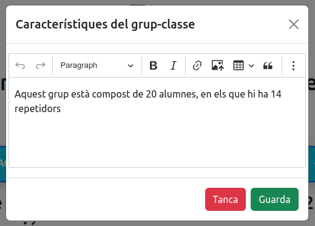

# 🧭 1. Contextualització

Quan hem entrat en la secció 1, podem veure la contextualització a nivell de centre, departament i del grup-classe. En aquest cas, nosaltres sols podem treballar en l'últim punt, contextualitzar per al grup classe.

<figure><figcaption>
Secció de la contextualització
</figcaption></figure>

Per a modificar o afegir les característiques del grup classe, hem de fer clic al botó: Afegir/Modificar característiques del grup-classe i se'ns mostrarà un editor de text enriquit, que ens permetrà dur a terme la tasca:

<figure><figcaption>
Editor de Text Enriquit per a modificar les característiques del grup classe
</figcaption></figure>

Polsem en Guarda i ja tindrem la descripció actualitzada.&#x20;
