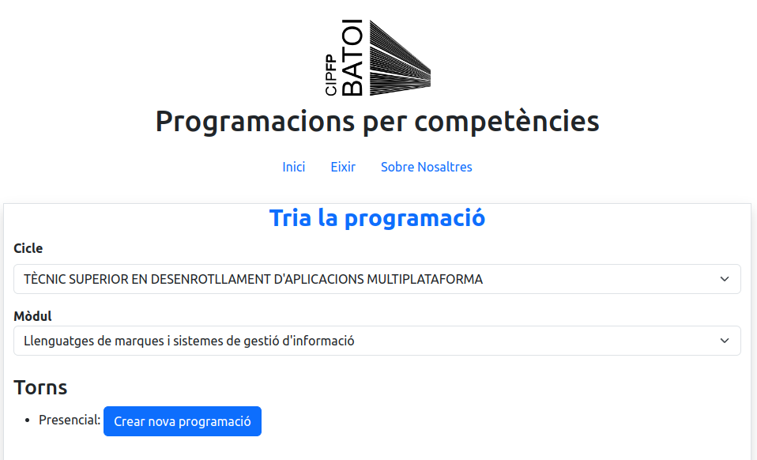
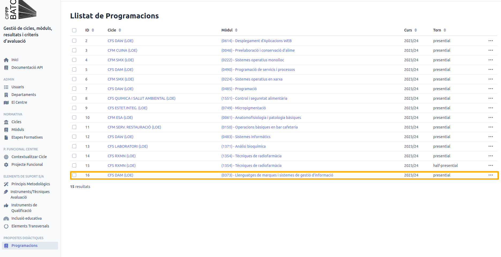

# 🗃️ Fent la Programació

Per defecte, quan accedim per primera vegada i encara no veiem a l'aplicació de **Programacions** a la secció **Propostes Didàctiques** la nostra programació, al seleccionar-la en la aplicació de Programacions, se'ns mostrarà el botó per a crear-ne una nova. Es selecciona de la següent forma:

Hem de seleccionar per ordre fins que trobem la programació que volem:

1. **Cicle:** Seleccionem el cicle formatiu per al que hem desenvolupar la aplicació.&#x20;
2. **Mòdul:** Seleccionem el mòdul ( Si no ens apareix el mòdul que volem serà perquè la selecció del cicle no ha estat ben realitzada.
3. Fem clic en el botó `Editar` o `Crear Nova Programació` en funció de l'estat de la Proposta Didàctica en la que vulguem treballar. &#x20;

## Creació d'una nova programació

Quan la nostra programació no està creada, la primera vegada que accedim a aquesta secció crearem la programació.&#x20;

<figure><figcaption>
Programacions actualment creades, que no vol dir completes
</figcaption></figure>

En aquest cas, per exemple, la programació del mòdul **Llenguatges de Marques i Sistemes de Gestió Empresarial (LMSGI)** per al cicle formatiu de Desenrotllament d'Aplicacions Multiplataforma en modalitat presencial no està creat, per tant al seleccionar-la se'ns mostrarà l'opció per a crearla:

<figure><figcaption>
Se'ns mostra el botó Crear Nova Programació perquè no existeix
</figcaption></figure>

Una vegada la creem, ens apareixerà a la secció de Propostes Didàctiques i ja podrem el veure el PDF encara que ens apareixerà pràcticament buit. **Nota:** Pot ser que encara no tinguem accés per a veure la secció de programacions. A continuació es mostra imatge de l'aplicació Programacions amb la programació creada:

<figure><figcaption>
En aquest cas, se'ns mostra a l'últim lloc la nova programació creada
</figcaption></figure>

Una vegada hem creat la programació, l'assistent ens enviarà al pas [1.-contextualitzacio.md](1.-contextualitzacio.md "mention") perquè comencem a treballar en la programació.

## Editar una programació

Quan seleccionem la programació, si ja existeix, se'ns mostrarà el botó **Editar** i ens portarà a l'asistent

<figure><figcaption>
Selecció de la programació per a començar a fer el desenvolupament.
</figcaption></figure>
