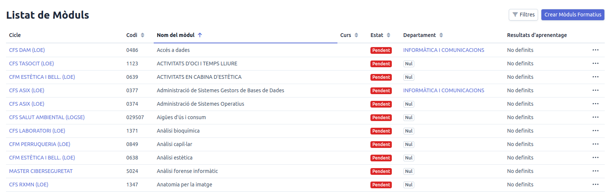
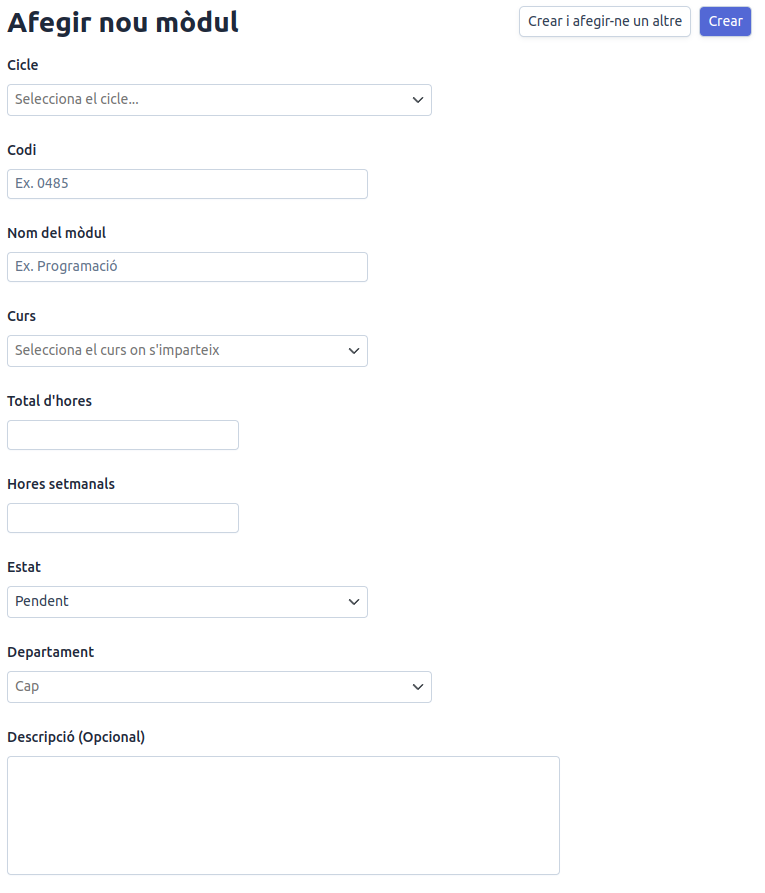
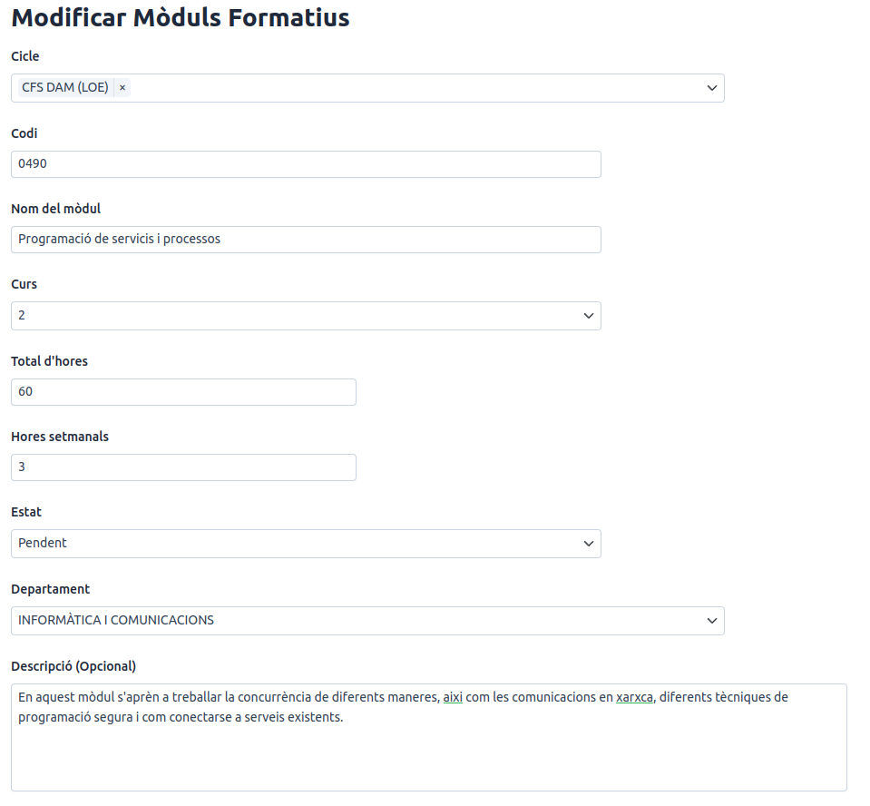
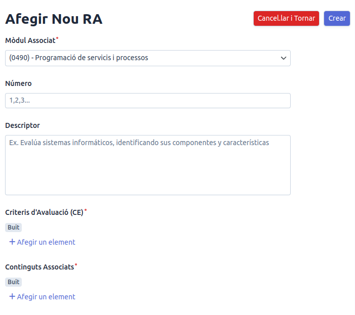
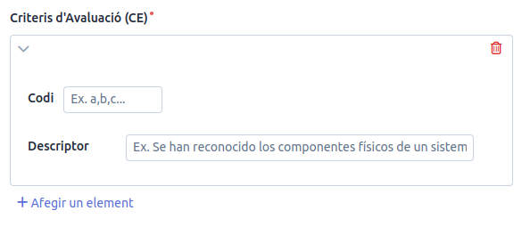
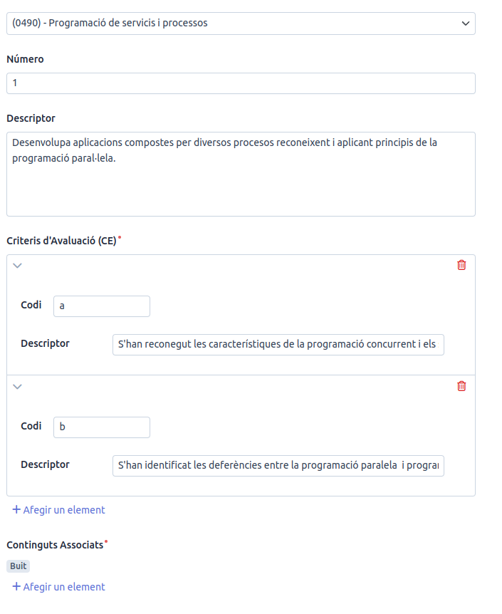
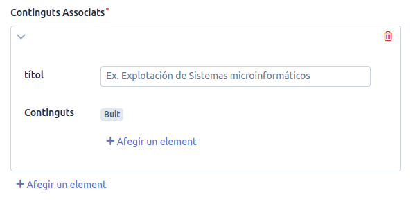
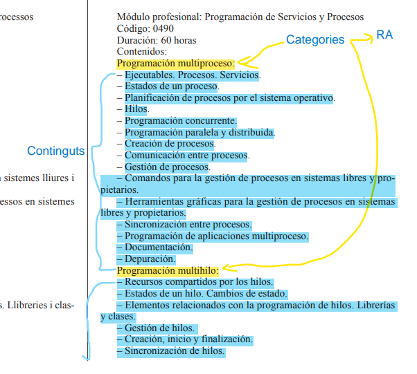
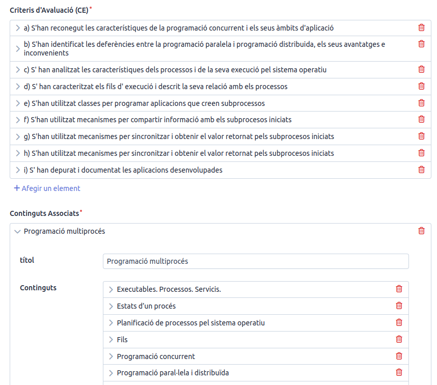

# Mòduls

Quan seleccionem l'opció **Mòduls** se'ns mostra la següent informació:

Aquest panell ens permet crear nous mòduls i actualitzar tota la informació necessària respecte a ells. Ara, en la última versió, quan accedim sols sens mostren els mòduls del **nostre departament**.

Quina informació del mòdul podem veure?:

1. **Cicle**: Cicle o **cicles** formatius als que pertany el mòdul ( tots sabem que hi ha mòduls que poder pertanyer a més d'un cicle formatiu)
2. **Codi**: Codi del mòdul tal i com ve al Reial Decret que el regula.
3. **Nom del mòdul**: Nom del mòdul tal i com ve al Reial Decret que el regula.
4. **Curs**: Curs en el que es cursa el mòdul.
5. **Estat**: Estat actual de la introducció de les dades de mòdul a la Intranet. De moment te 3 estats:
   1. *Pendent*: Aquest estat indica que el mòdul ha sigut creat però no s'ha introduït cap informació, o que la informació introduïda no és completa o de prova.
   2. *En progrés*: Aquest estat indica que el mòdul està en procés d'introducció de la informació.
   3. *Finalitzat*: Aquest estat indica que la informació del mòdul ha sigut introduïda completament, revisada per la persona que l'ha introduït, i que està disponible per a ser consultada.
6. **Departament**: Departament al que pertany el mòdul. 
7. **Resultats d'Aprenentatge**: Descripció dels resultats d'aprenentatge del mòdul amb els criteris d'avaluació corresponents.

## 1. Crear Mòduls

Per a crear mòduls hem de premer el botó **Crear Mòduls Formatius** i se'ns mostrarà un panell on hem d'emplenar els següents camps:

1. **Cicle**: Desplegable que ens permet seleccionar el **cicle** o **cicles** als que pertany el mòdul. Cada vegada que en seleccionem un, es mostrarà el nom curt del cicle seleccionat i al costat una icona que ens permet desasociar el cicle del mòdul.
2. **Codi**: Codi del mòdul tal i com ve al Reial Decret que el regula.
3. **Nom del mòdul**: Nom del mòdul tal i com ve al Reial Decret que el regula.
4. **Curs**: Desplegable que ens permet seleccionar el curs en el que s'imparteix el mòdul.
5. **Total d'hores**: Total d'hores de formació del mòdul tal i com venen a la normativa. Aquestes hores normalment les podem trobar a l'ordre de la comunitat autonomica que estableix el currículum per a la regió. En la nostra comunitat, aquesta informació la podem trobar al DOGV, però d'una manera més fàcil la podem trobar a <https://todofp.es/que-estudiar/loe.html> on buscarem el mòdul del nostre cicle formatiu.
6. **Hores setmanals**: Hores setmanals de formació del mòdul tal i com venen a la normativa. Aquestes hores normalment les podem trobar a l'ordre de la comunitat autonomica que estableix el currículum per a la regió. En la nostra comunitat, aquesta informació la podem trobar al DOGV, però d'una manera més fàcil la podem trobar a <https://todofp.es/que-estudiar/loe.html> on buscarem el mòdul del nostre cicle formatiu.
7. **Estat**: Desplegable que ens permet seleccionar l'estat del mòdul. Aquest camp es pot modificar en qualsevol moment.
8. **Departament**: Desplegable que ens permet seleccionar el departament al que pertany el mòdul.
9. **Descripció (Opcional)**: Camp de text que ens permet introduir lliurement una descripció del mòdul.

A continuació es mostra per mòdul professional de Programació de Serveis i Processos com quedaria:

Una vegada estem conformes en com queda tota la informació polsarem el botó: "Desar i tancar" i es guardarà el mòdul i es tancarà la finestra.

Ara al llistat de mòduls, si no el veiem, el buscarem mitjançant els filtres.

Ara es moment de veure com el podem modificar i com es pot treballar amb els **resultats d'aprenentatge associats al mòdul**

## 2. Modificar els mòduls

Per a modificar un mòdul hem de fer clic al botó **...** que es troba a la dreta del tot de cada entrada de cada mòdul i polsar en **Modificar**.

Se'ns mostrarà la pantalla de la secció anterior però amb les dades del mòdul plenes en lloc de buides.

## 3. Crear i Modificar Resultats d'Aprenentatge del mòdul

Quan volem afegir un resultat d'aprenentatge, hem de fer clic al botó **...** del mòdul existent en qüestió i polsar en **Afegir Nou RA** per accedir directament o bé a qualsevol de les altres opcions com *Veure* o *Modificar* i després polsar en *Afegir Nou RA* que apareixerà dalt a la dreta de la pantalla.

Un cop hem fet clic en **Afegir Nou RA** se'ns mostrarà un panell en el que tenim la següent informació:

1. **Mòdul Associat**: Identificador del mòdul formatiu al que pertany aquest Resultat d'Aprenentatge.
2. **Número**: Número del resultat d'aprenentatge. Aquest número indica l'ordre en que es presenten els resultats d'aprenentatge en el Reial Decret que regula el mòdul.
3. **Descriptor**: Descripció del resultat d'aprenentatge tal i com ve al Reial Decret que estableix la titolació o a l'actualització.
4. **Criteris d'avaluació**: Secció que ens permet afegir una a un cadascun dels criteris d'avaluació del resultat d'aprenentatge (Cada vegada que vulguem afegir un CA hem de fer clic a l'opció **Afegir un element**). Aquests criteris d'avaluació els podem trobar al Reial Decret que regula el mòdul o a l'actualització del mateix.
5. **Continguts Associats**: Secció que ens permet afegir els continguts per al resultat d'aprenentatge. En aquest cas hem d'afegir la categoria principal del contingut ( que es la que es correspon amb el resultat d'aprenentatge) i després els continguts en sí tal i com venen al currículum de la Comunitat autònoma o, en el cas de que no hi haja regulació autonòmica) al Reial Decret que regula el mòdul.

### 3.1. Afegir Criteris d'Avaluació

Per a afegir un criteri d'avaluació hem de fer clic al botó **Afegir un element** i se'ns mostrarà un panell en el que hem d'emplenar els següents camps:

1. **Codi**: Codi del criteri d'avaluació tal i com ve al Reial Decret que regula el mòdul o a l'actualització.
2. **Descriptor**: Descripció del criteri d'avaluació tal i com ve al Reial Decret que regula el mòdul o a l'actualització.

> Tota la informació dels criteris d'avaluació la podem trobar al Reial Decret que regula el mòdul o a l'actualització del mateix i els podem consultar a la web <https://todofp.es/que-estudiar/loe.html>

Per al cas del mòdul de Programació de Serveis i Processos del cicle formatiu de Desenrotllament d'Aplicacions Multiplataforma, els dos primers criteris d'avaluació quedaria de la següent manera:

### 3.2. Afegir Continguts

Per a afegir un contingut hem de fer clic al botó **Afegir un element** dintre de la secció i se'ns mostrarà un panell en el que hem d'emplenar els següents camps:

Aquest pas l'hem de realitzar per a cadascuna de les catergories de continguts (Els continguts que al reial decret o al currículum tenen al final **:**) que es relacionen amb el resultat d'aprenentatge. Aquests camps són:

1. **Títol**: Títol de la categoria del contingut tal i com ve al currículum de la Comunitat Autònoma o be al Reial Decret, per a identificar-la hem de buscar a la secció continguts tots els continguts que acaben amb **:**, d'aquesta manera sabrem que es tracta d'una categoria de continguts i no d'un contingut en sí, que es relaciona directament amb el resultat d'aprenentatge.
2. **Contingut**: Contingut en sí tal i com ve al currículum de la Comunitat Autònoma o be al Reial Decret, per a identificar-lo hem de buscar a la secció continguts tots els continguts que solen començar amb amb **-**, d'aquesta manera sabrem que es tracta d'un contingut en sí i no d'una categoria de continguts, que es relaciona directament amb el resultat d'aprenentatge.

> Tota la informació dels continguts la podem trobar al Reial Decret que regula el mòdul o a l'actualització del mateix i els podem consultar a la web <https://todofp.es/que-estudiar/loe.html>

A continuació es mostra com extraure les categories de continguts i els continguts en sí del Currículum de la Comunitat valenciana per al mòdul de Programació de Serveis i Processos del cicle formatiu de Desenrotllament d'Aplicacions Multiplataforma:

> Ara ens quedaria acabar e introduir els continguts. Per a que ens deixe *desar*, hem d'introduir al menys un CA i un contingut.

En la següent imatge podem veure com quedaría el resultat d'aprenentatge amb els criteris d'avaluació i els continguts associats:

