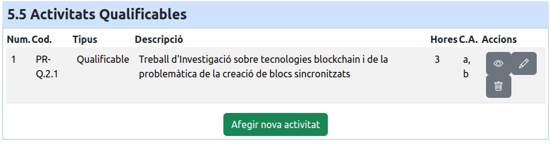

# ⁉️ QA

## Com traduir al Valencià els Reials Decrets?

Per a traduir els real decrets i treballar d'una manera fluida per, recomane utilitzar un navegador que incorpore la funcionalitat de traducció de pàgines web. Per exemple, [Microsoft Edge](https://www.microsoft.com/es-es/edge/download), que es multiplataforma, incorpora aquesta funcionalitat i ens permet dividir la pantalla, de forma que podem veure a un costat la pantalla d'edició de les competències i a l'altra, el Reial Decret traduït o el document amb el que estiguem treballant al mateix temps.&#x20;

Exemple d'utilització: Com afegir un Objectiu a un cicle traduït al Valencià:

1. Obrim el navegador i en una pestaña obrim la aplicació de https://programacions.cipfpbatoi.es i anem a editar el cicle formatiu de grau superior **Desenrotllament d'Aplicacions Multiplataforma** i fem clic en modificar i accedim a la secció **Objectius** del cicle.
2. Obrim una nova pestanya i busquem el Reial decret o l'actualització per a copiar els objectius. La millor forma d'accedir es mitjançant el recurs del Ministeri [https://todofp.es/que-estudiar/loe.html](https://todofp.es/que-estudiar/loe.html) i així podrem accedir al Reial decret o a l'actualització en cas de que hi haja una. Per **DAM** l'actualització és: Real Decreto 405/2023, de 29 de mayo; per tant utilitzarem aquesta en lloc del Reial Decret que crea la titulació.
3. Tornem a la pestanya on es troba l'aplicació de programacions.
4. Ara hem de fer clic al botó Dividir Pantalla que es troba a la dreta de la **Barra de búsqueda.** Aquest botó te forma de quadrat amb una ralla vertical que el secciona pel mig. _Més endavant adjuntaré les captures del procés_
5. Com la pestanya en la que estem, es la de les programacions, hem de seleccionar la pestaña amb l'actualització.
6. Ara ja tenim les dues pestanyes mostrades. Fem clic en qualsevol part de la pestanya de l'actualització i prenem el botó dret del ratolí.&#x20;
7. Se'ns mostrarà l'opció traduir, si es al Català, fem clic i ja hem acabat. Si no, caldrà fer clic en l'opció per a traduïr i després canviar l'idioma traduït. Encara que el document estiga en Espanyol, l'hem de traduir a l'Espanyol si es l'opció que tenim habilitada, es per a que ens mostre la opció per a canviar-ho.&#x20;
8. Cal seleccionar la icona que indica que el document ha estat traduït i canviar l'idioma de traducció.

<figure><figcaption>
Icona per a dividir la pantalla a Edge
</figcaption></figure>

<figure><figcaption>
Hem de seleccionar la pestaña del Reial Decret en la finestra de la Dreta
</figcaption></figure>

Una volta es mostren els dos documents, hem de fer clic al botó de la dreta dintre del document del Reial Decret i seleccionar: **Traducir al catalán** i ja hauríem finalitzat. Si no, hem d'executar el pas següent:

<figure><figcaption>
Seleccionem traducir al catalán o a l'idioma que ens aparega
</figcaption></figure>

Si l'opció que tenim es Español, hem de traduir igualment, i fer clic en el botó que es mostrarà dintre de la barra de direccions al final.&#x20;

<figure><figcaption>
Mitjançant aquest editor, podrem seleccionar un altre idioma i canviarem el document.
</figcaption></figure>

Ara ja podem treballar amb el document traduït i podrem copiar i enganxar ( sempre comprovant que la traducció estiga ben realitzada) des del Reial Decret cap a l'aplicació

En el [vídeo sobre com afegir i modificar objectius del cicles formatius](https://gvaedu.sharepoint.com/:v:/s/Section\_03012165-C2-APP-PROGRAMACIPERCOMPETNCIES/EQ2xZ-JAOUNMradymVIIv-cBT0e4qSDCJDPJsMsNYe5WPg?e=tQWscf) que es troba a la [secció de vídeos](videos-explicatius.md) explicatius cap a l'instant 2:45 podem veure una explicació similar dels passos.&#x20;

> Cal seleccionar el **punt i a part** de les frases per a qué al mostrar la informació, sempre quede coherent.&#x20;

## Creació del procés tecnològic del mòdul mitjançant draw.io&#x20;

A continuació s'explica com realitzar la imatge requerida a l'apartat **Procés Tecnològic** del mòdul utilitzant la ferramenta lliure [https://www.drawio.com/](https://www.drawio.com/). Aquesta ferramenta es pot utilitzar bé on-line, bé en format off-line per accedir. Aquest manual s'ha desenvolupat treballant amb la última versió on-line i off-line disponibles a dia 25/04/24.

### Creació del Nou diagrama

Per a la versió on-line, cal accedir a [https://app.diagrams.net/?src=about](https://app.diagrams.net/?src=about) amb el que ens creará un diagrama nou. El primer que ens pregunta es si volem crear un diagrama nou i després on volem que l'aplicació el dese, seleccionarem disc i li posarem un nom al fitxer:&#x20;

Seleccionem on volem que el dese

<figure><figcaption>
Seleció del dispositiu on desarà el diagrama
</figcaption></figure>

Seleccionem que volem crear un diagrama nou

<figure><figcaption>
Selecció de Crear o Obrir
</figcaption></figure>

Posem el nom del diagrama i seleccionem **Diagrama en blanc** o qualsevol que se'ns adapte millor i fem clic en **Crea**

<figure><figcaption>
Selecció d'una plantilla
</figcaption></figure>

<figure><figcaption>
Nou diagrama
</figcaption></figure>

### Configuració del Llenç

Una vegada tenim el diagrama creat, l'hem de configurar per a que les dimensions del llenç del diagrama siguen les mateixes o estiguen dins del que ens demana la aplicació. A continuació s'estableix la relació entre les mesures en pixels que demana l'Aplicació de les programacions i les mesures en polsades (**in**ches en anglés) que es com defineix l'amplada del diagrama (La **primera mesura fa referència a l'amplada i la següent fa referència a l'altura del document**):

| App Programacions (Pixels) | draw.io (Polsades - in ) |
| -------------------------- | ------------------------ |
| 500x500                    | 5x5                      |
| 500x600                    | 5x6                      |
| 500x700                    | 5x7                      |
| 500x800                    | 5x8                      |

Com es pot observar, **cada polsada del diagrama equival, a l'hora d'exportar el diagrama a 100 pixels**. Aquesta mesura no es troba a la documentació de [https://www.drawio.com/](https://www.drawio.com/) es un valor que s'ha obtingut empíricament per a realitzar aquest manual.&#x20;

Les mesures del diagrama es poden canviar una vegada establertes, per tant, podem elegir el tamany més gran de diagrama i una vegada el tinguem, el podem reduir per a que ens quede compacte.

Ara cal que fem clic dalt a la dreta del digrama per a establir la configuració a una icona que es com un llapis i un regle:

<figure><figcaption>
Selecció de la configuració del diagrama
</figcaption></figure>

A continuació hem de seleccionar el Desplegable **Mida de Paper** i fer clic a _**Personalitza**. Se'ns mostrarà un panell que ens permet introduir les mesures en polsades (in de l'anglés inch)._&#x20;

<figure><figcaption></figcaption></figure>

En aquest cas harem d'introduir les mesures que vulguem treballar, per exemple 5x5 per a treballar amb un llenç de 500x500 pixels:

<figure><figcaption></figcaption></figure>

Una vegada hem establit les dimensions, ens pot servir **de molta ajuda habilitar la Quadrícula** i establirla a 5pt per a que ens servisca de guía a l'hora de fer el nostre diagrama. Recomane no arribar al final del diagrama perquè si no, no e veurà la última línea de l'element ( Amb la quadrícula habilitada, cal deixar un Quadre de borde).

Una vegada realitzats aquests pasos, ja podem començar a treballar amb el diagrama i quan el tinguem finalitzat l'hem de desar (Amb extensió drawio per si fera falta editar), l'hem d'exportar a un dels dos formats d'imatge que admet l'aplicació: **png** o **jpg** tal i com s'indica al següent apartat:

### Exportar el diagrama en format imatge

Per exportar el diagrama cal anar dal a la dreta a la icona de cercle en 3 punts que es troba just al costat de la configuració i fer clic per a que se'ns mostre el panel d'opcions del document:

<figure><figcaption>
Accés al panell d'opcions
</figcaption></figure>

En aquest cas, hem d'accedir al submenú **Exporta com a** i seleccionar PNG o JPG:&#x20;

<figure><figcaption></figcaption></figure>

En el cas de seleccionar JPEG hem de assegurar-se que a la opció **Mida** pose **Pàgina** i que l'**Amplada de la Vora** siga 0 i fer clic en **Exporta**

<figure><figcaption>
Opcions per a JPEG
</figcaption></figure>

En el cas de que s'elegisca com a format PNG, les opcions son similars però cal centrar-se en les de la Mida i l'Amplada.
